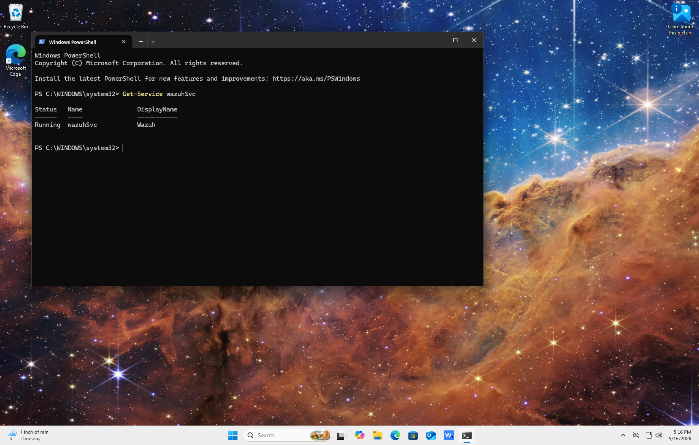
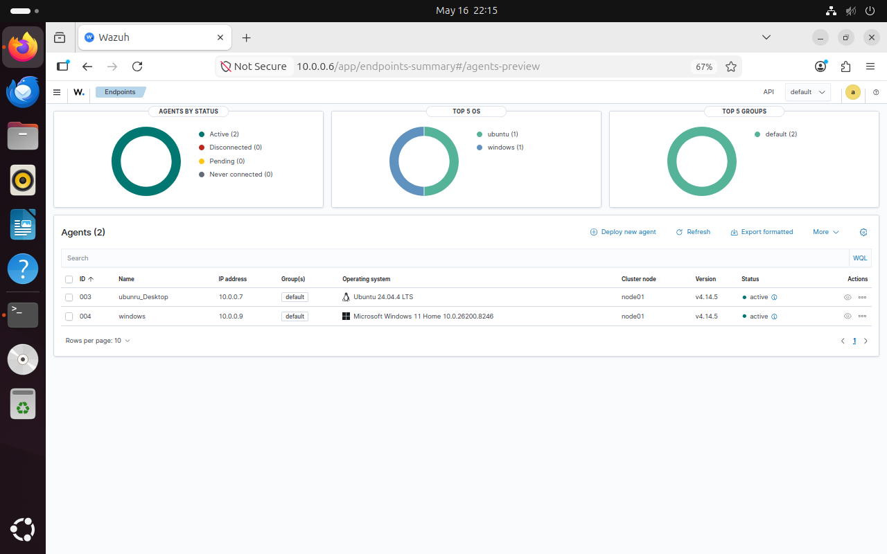
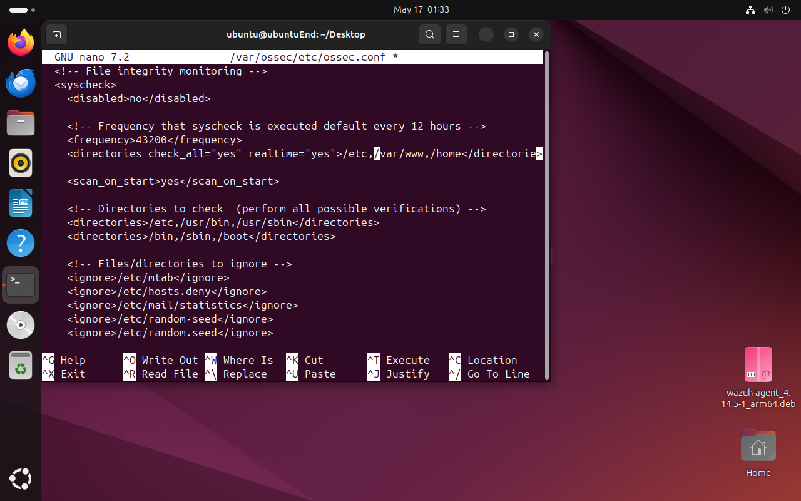
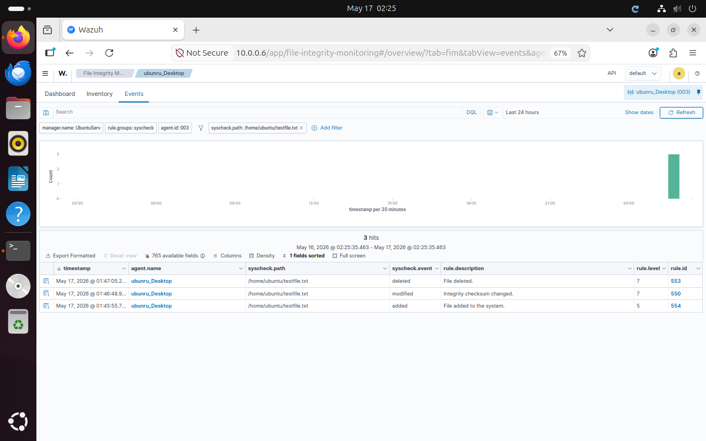
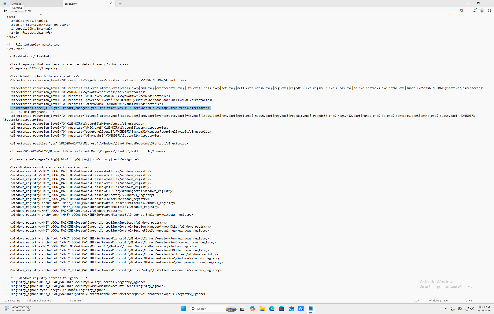
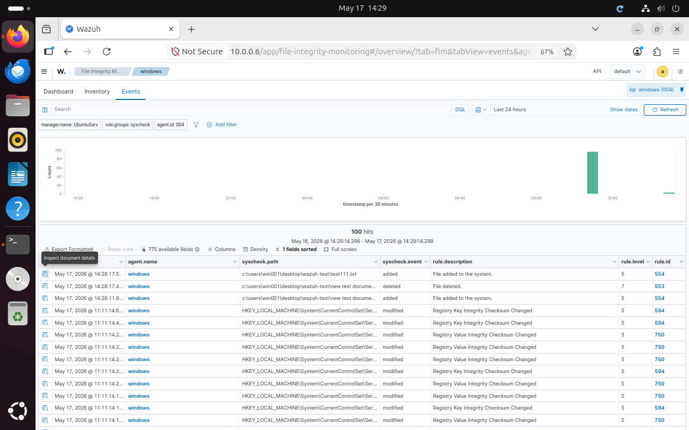

# File Integrity Monitoring with Wazuh

## Overview

This project demonstrates the implementation of a File Integrity Monitoring (FIM) solution using Wazuh in a VirtualBox homelab environment. The objective is to monitor critical files and directories for unauthorized changes, detect suspicious activity, and generate security alerts through the Wazuh Dashboard.

File Integrity Monitoring is an important security control used to detect:

* Unauthorized file modifications
* Malware activity
* Configuration changes
* Privilege escalation attempts
* Insider threats
* Policy violations

The project uses Ubuntu Server as the Wazuh Manager ,Windows 11 and Ubuntu Desktop as the monitored endpoint.

---

# Lab Environment

| System         | Role                      |
| -------------- | ------------------------- |
| Ubuntu Server  | Wazuh Server              |
| Ubuntu Desktop | Monitored Endpoint        |
| Windows 11     | Monitored Endpoint|

Network Type: Bridged Adapter

---

# Hardware Requirements

| Component      | Requirement         |
| -------------- | ------------------- |
| CPU            | Dual-Core Processor |
| RAM            | 8 GB Minimum        |
| Storage        | 80 GB               |
| Hypervisor     | VirtualBox          |
| Virtualization | Enabled in BIOS     |

---

# Software Requirements

* VirtualBox
* Ubuntu Server
* Ubuntu Desktop
* Wazuh
* Linux CLI Tools
* Windows 11

---

# Project Objectives

* Deploy Wazuh Server on Ubuntu Server
* Deploy Wazuh Agent on Ubuntu Desktop
* Configure File Integrity Monitoring
* Monitor sensitive directories and files
* Detect unauthorized changes
* Generate alerts in Wazuh Dashboard
* Simulate attacks and file modifications
* Analyze generated alerts

---

# Virtual Machine Setup

## Ubuntu Server

Recommended configuration:

* RAM: 4 GB
* CPU: 2 Cores
* Storage: 50 GB
* Network Adapter: Bridged Adapter

---

## Ubuntu Desktop

Recommended configuration:

* RAM: 4 GB
* CPU: 2 Cores
* Storage: 40 GB
* Network Adapter: Bridged Adapter

---

## Windows 11

Recommended configuration:

* RAM: 2 GB
* CPU: 2 Cores
* Storage: 30 GB
* Network Adapter: Bridged Adapter

---

# Installing Wazuh Server

Update Ubuntu Server:

```bash
sudo apt update && sudo apt upgrade -y
```

Download Wazuh installer:

```bash
curl -sO https://packages.wazuh.com/4.x/wazuh-install.sh
```

Run installation:

```bash
sudo bash wazuh-install.sh -a
```

This installs:

* Wazuh Manager
* Wazuh Dashboard
* Wazuh Indexer
* Filebeat

---

# Access Wazuh Dashboard

Open browser:

```text
https://WAZUH_SERVER_IP
```

Login with generated credentials displayed after installation.

---

# Verify Wazuh Services

Check Wazuh manager:

```bash
sudo systemctl status wazuh-manager
```

---

# Deploy Wazuh Agent on Ubuntu Desktop


How to Deploy Ubuntu Desktop Agent on Wazuh Dashboard

Deployment Steps

# 1. Access Wazuh Dashboard

1. Open Wazuh Dashboard in your web browser
2. Navigate to Endpoints → Deploy new agent
3. Confirm you're on the "Deploy new agent" tab


2. Select Linux Agent Architecture
   
* Choose the appropriate package for your system:

|Package Type   |Use Case                                 |
|---------------|-----------------------------------------|
|**DEB amd64**  |64-bit Intel/AMD processors (most common)|
|**DEB aarch64**|ARM-based systems (shown in example)     |
|RPM amd64      |64-bit RedHat/CentOS systems             |
|RPM aarch64    |ARM-based RedHat/CentOS systems          |

Example: Select DEB aarch64 for ARM-based Ubuntu systems


3. Configure Server Address

* Field: Assign a server address

Value: 10.0.0.6 (or your Wazuh Manager IP/FQDN)

Option: Check "Remember server address" to save for future deployments


4. Set Agent Name

* Field: Assign an agent name

  Default: Uses system hostname

Example: ubuntu_Desktop

  Note: Agent name must be unique and cannot be changed after enrollment


5. Select Agent Groups

* Field: Select one or more existing groups

   Example: Default

Purpose: Organize and manage agent policies


6. Execute Installation Commands
   
   Copy and run the provided installation commands on your Ubuntu system:

# Commands will be displayed in the dashboard

 Example structure:
 
    # curl -s <download_url> | sudo bash


sudo systemctl start wazuh-agent


sudo systemctl enable wazuh-agent


7. Verify Agent Enrollment
---

1. Return to Wazuh Dashboard

2. Check Agents list for your ubuntu_Desktop agent
   
3. Confirm status shows "Active"
---
# Deploy Wazuh Agent on Windows Desktop
 Step 1: Access the Wazuh Dashboard

1. Open a web browser
2. Navigate to the Wazuh Dashboard:

```text
   https://WAZUH_SERVER_IP
```

3. Log in using administrator credentials
4. Navigate to:

```text
   Endpoints → Deploy new agent
```

This section generates installation commands for endpoint enrollment.

---

# Step 2: Select Windows Agent Package

Under operating system selection:

```text
  Windows
```

Select package architecture:

```text
  Windows MSI 64-bit
```

This package is used for standard Windows 11 systems.

---

# Step 3: Configure Wazuh Manager Address

Under:

```text
  Assign a server address
```

Enter the IP address or hostname of the Wazuh Manager.

Example:

```text
    10.0.0.6
```

Optional:

* Enable “Remember server address” for future deployments

This allows the Windows agent to communicate with the Wazuh server.

---

# Step 4: Configure Agent Name

Under:

```text
    Assign an agent name
```

Enter a unique endpoint identifier.

Example:

```text
    Windows11-Endpoint
```

Important:

* Agent names must be unique
* Agent names cannot be modified after enrollment

---

# Step 5: Select Agent Group

Choose an existing Wazuh group.

Example:

```text
    Default
```

Groups help organize endpoints and apply centralized monitoring policies.

---

# Step 6: Run Installation Command

The Wazuh Dashboard automatically generates a PowerShell installation command.

  Open PowerShell as Administrator and run the generated command.

Example:

```powershell
      Invoke-WebRequest -Uri https://packages.wazuh.com/4.x/windows/wazuh-agent-4.x.x-1.msi -OutFile wazuh-            agent.msimsiexec.exe /i wazuh-agent.msi /q WAZUH_MANAGER='WAZUH_SERVER_IP' WAZUH_AGENT_NAME='Windows11-Endpoint'
```

Start the Wazuh service:

```powershell
    NET START WazuhSvc
```

These commands:

* Download the Wazuh agent
* Install the agent silently
* Configure manager communication
* Register the endpoint
* Start monitoring services

---

# Step 7: Verify Agent Service

Check Windows service status:

```powershell
    Get-Service WazuhSvc
```

Expected output:

```text
    Running
```


---


# Verify Agent Enrollment

Navigate to:

```text
    Wazuh Dashboard → Agents
```

Expected status for both ubuntu and windows:

```text
    Active
```


---

# Configure File Integrity Monitoring on Ubuntu

Edit Wazuh agent configuration:

```bash
    sudo nano /var/ossec/etc/ossec.conf
```

Locate the syscheck section.

Example configuration:

```xml
<syscheck>
  <frequency>43200</frequency>
  <directories check_all="yes" realtime="yes">/etc,/var/www,/home</directories>
</syscheck>
```

Explanation:

* `frequency` defines scan interval in seconds
* `check_all="yes"` monitors all file attributes
* `realtime="yes"` enables immediate change detection
* `/etc` monitors Linux configuration files
* `/home` monitors user directories
* `/var/www` monitors web application files

---

# Restart Wazuh Agent

Apply configuration changes:

```bash
sudo systemctl restart wazuh-agent
```

---

# Verify FIM Configuration

Check Wazuh logs:

```bash
sudo tail -f /var/ossec/logs/ossec.log
```

Expected output:

```text
Starting syscheck scan.
```

---

# File Monitoring Test

Create a monitored file:

```bash
touch ~/testfile.txt
```

Modify the file:

```bash
echo "Security test" >> ~/testfile.txt
```

Delete the file:

```bash
rm ~/testfile.txt
```

Expected Result:

* Wazuh detects file creation
* Wazuh detects modification
* Wazuh detects deletion
* Alerts appear in dashboard
---

# Simulate Unauthorized Changes

Modify a monitored system file:

```bash
sudo echo "Unauthorized change" >> /etc/hosts
```

Expected Result:

* File modification alert generated
* Alert visible in dashboard
* Event severity assigned

---

# Monitoring Alerts in Wazuh Dashboard

Navigate to:

```text
Security Events
```

FIM alerts display:

* File path
* Event type
* Timestamp
* User account
* File checksum changes
* Alert severity

---

# Example FIM Alert

```json
{
  "rule": {
    "level": 7,
    "description": "File modified"
  },
  "syscheck": {
    "path": "/etc/hosts",
    "event": "modified"
  }
}
```

---

# Common FIM Event Types

| Event    | Description           |
| -------- | --------------------- |
| added    | New file created      |
| modified | Existing file changed |
| deleted  | File removed          |
| renamed  | File name changed     |

---

Expected Result:

* Wazuh generates FIM alert
* Dashboard records file activity
* Alerts contain event details

---
# Configure File Integrity Monitoring on windows 11

Edit Wazuh agent configuration:
```
C:\Program Files (x86)\ossec-agent\ossec.conf
```

---

Syscheck Configuration

```xml
<syscheck>
  <frequency>43200</frequency>
  <directories check_all="yes" realtime="yes">C:\Users</directories>
</syscheck>
```

---

Configuration Fields

```
frequency
Interval between full integrity scans in seconds

check_all
Monitors file attributes including hash, size, permissions

realtime
Triggers immediate detection on file changes

directories
Defines monitored file paths

```

---

Restart Wazuh Agent

PowerShell

```
Restart-Service WazuhSvc
```

Command Prompt

```
net stop WazuhSvc
net start WazuhSvc
```

---
# Back on the wazuh server dashboard 
Expected result

```
File added

```
---

Dashboard Review


Event fields

```
file.path
event.type
timestamp
user.name
syscheck.diff
syscheck.checksum
rule.level
```

---
# Benefits of File Integrity Monitoring

* Detects unauthorized file changes
* Monitors critical system files
* Improves endpoint visibility
* Supports compliance requirements
* Helps detect malware persistence
* Provides real time monitoring

---

# Skills Demonstrated

* SIEM deployment
* Endpoint monitoring
* Linux administration
* File Integrity Monitoring
* Log analysis
* Threat detection
* Security monitoring
* VirtualBox networking

---

# Future Improvements

* Add malware detection rules
* Integrate Suricata alerts
* Configure email notifications
* Create automated incident response actions
* Add centralized log retention

---

# Repository Structure

```text
wazuh-fim-project/
├── screenshots/
├── configs/
│   └── ossec.conf
├── logs/
├── attack-simulation/
├── README.md
└── documentation/
```

---

# Resume Project Description

Built a File Integrity Monitoring solution using Wazuh and Ubuntu systems in a VirtualBox lab environment. Configured real time monitoring of critical directories, detected unauthorized file modifications, and analyzed security alerts through the Wazuh dashboard.

---

# Author

Macintosh Fatal

Cybersecurity Student | SOC Analyst Aspirant | Homelab Enthusiast
